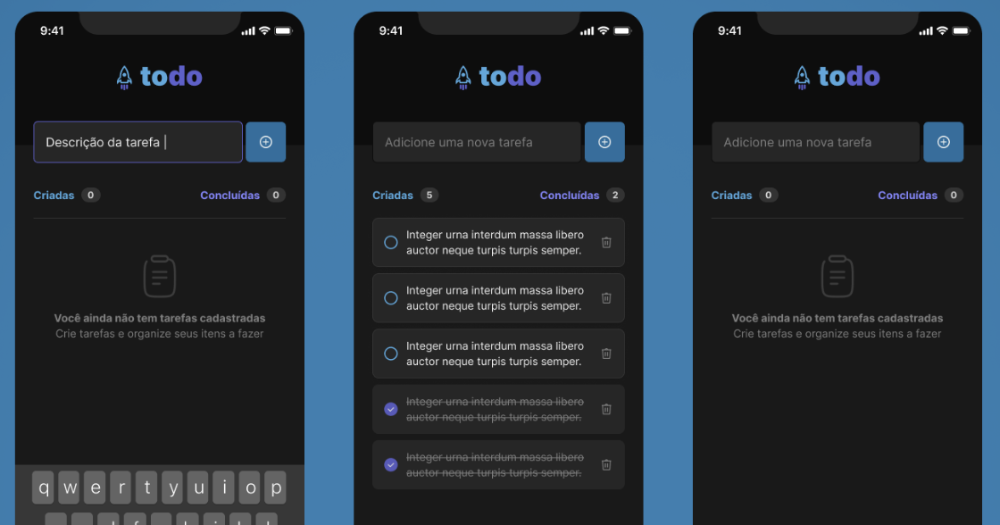

## 💻 Projeto
<h2 id="CHAPTERII">
  Todo List
</a>

  
   

    
  

 

## ✨ Tecnologias

- [React Native](https://reactnative.dev/)
- [TypeScript](https://www.typescriptlang.org/)
- [Expo](https://expo.io/)

## Executando o projeto

*yarn install || npm install

*expo start

## Você vai me encontrar em qualquer uma das redes sociais abaixo:

